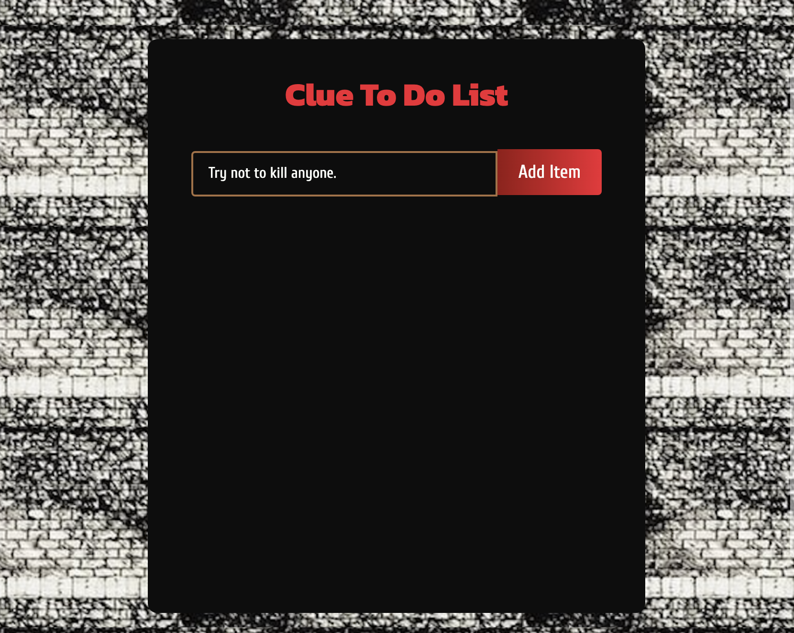
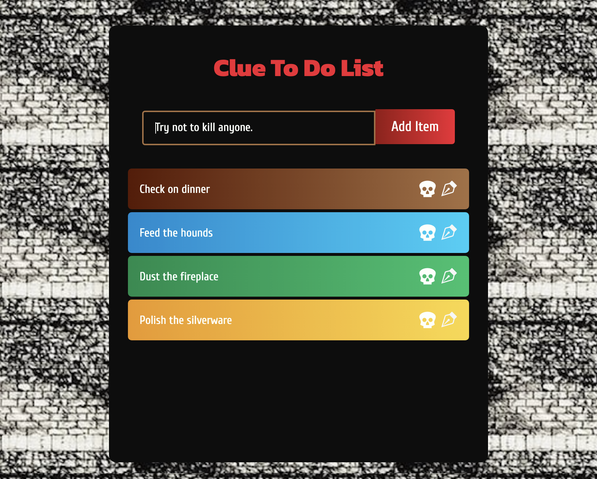
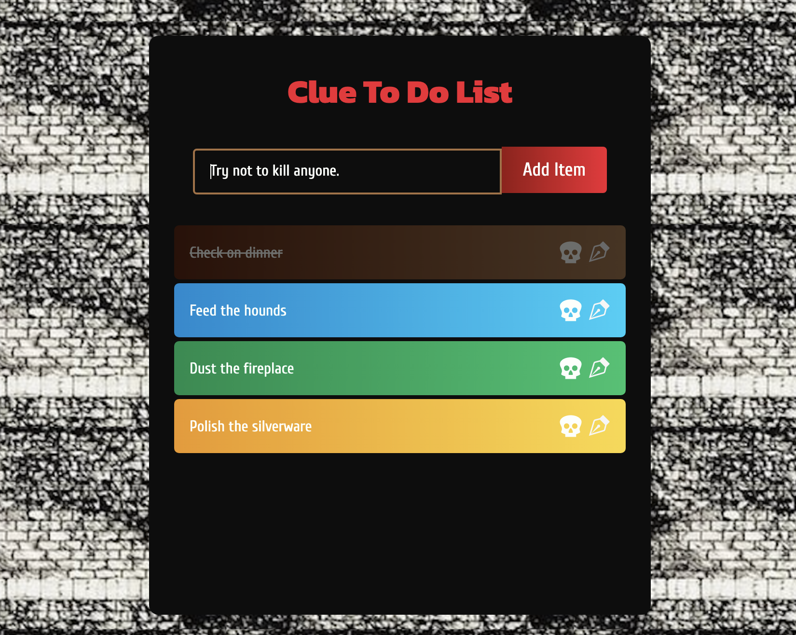

# Clue To Do App

Whether planning a dinner party or simply going about your day, The Clue To Do App removes the chance that you'll forget to complete something important! No more surprises when you add the essentials to your handy React list. 

## Table of contents

- [Technologies](#technologies)
- [Mockup](#mockup)
- [Resources-used](#resources-used)
- [Future-plans](#future-plans)
- [Github-url](#github-url)
- [Author](#author)
- [Licensing](#licensing)

## Technologies

This application was built using HTML, CSS, JavaScript, React.

Users do not need setup.

---

## Mockup

The following images shows the website in play!

 &nbsp;

Opening the Clue To Do App looks something like this. 🎲 

 &nbsp;

This is also how the app can look. 🔎

 &nbsp;

The Clue To Do App may even look this way! 🔧

---

## Resources-used

* <a href="https://www.youtube.com/watch?v=E1E08i2UJGI" target="_blank"> A React tutorial from Brian Design was used as guidance for this project. </a> 

* <a href="https://github.com/briancodex/react-todo-app-v1" target="_blank"> The creator's GitHub repo can be found at his handle @briancodex.</a> 

## Future-plans

In the future, I would like make task completion more intutive by adding as React icon to click instead of clicking on the entire task. 

I also plan to host this project somewhere for easier viewing. 

---

## Github-url

<a href="https://github.com/AmyShafer/clue-todo" target="_blank"> Clue To Do App </a>

## Author

This application was created by Amy U. Shafer. You can reach her at amy.u.shafer@gmail.com ✨

## Licensing

MIT License

Copyright (c) 2022 Amy U. Shafer

Permission is hereby granted, free of charge, to any person obtaining a copy
of this software and associated documentation files (the "Software"), to deal
in the Software without restriction, including without limitation the rights
to use, copy, modify, merge, publish, distribute, sublicense, and/or sell
copies of the Software, and to permit persons to whom the Software is
furnished to do so, subject to the following conditions:

The above copyright notice and this permission notice shall be included in all
copies or substantial portions of the Software.

THE SOFTWARE IS PROVIDED "AS IS", WITHOUT WARRANTY OF ANY KIND, EXPRESS OR
IMPLIED, INCLUDING BUT NOT LIMITED TO THE WARRANTIES OF MERCHANTABILITY,
FITNESS FOR A PARTICULAR PURPOSE AND NONINFRINGEMENT. IN NO EVENT SHALL THE
AUTHORS OR COPYRIGHT HOLDERS BE LIABLE FOR ANY CLAIM, DAMAGES OR OTHER
LIABILITY, WHETHER IN AN ACTION OF CONTRACT, TORT OR OTHERWISE, ARISING FROM,
OUT OF OR IN CONNECTION WITH THE SOFTWARE OR THE USE OR OTHER DEALINGS IN THE
SOFTWARE.